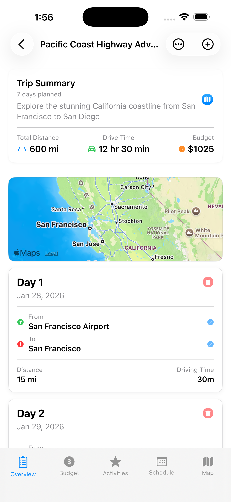
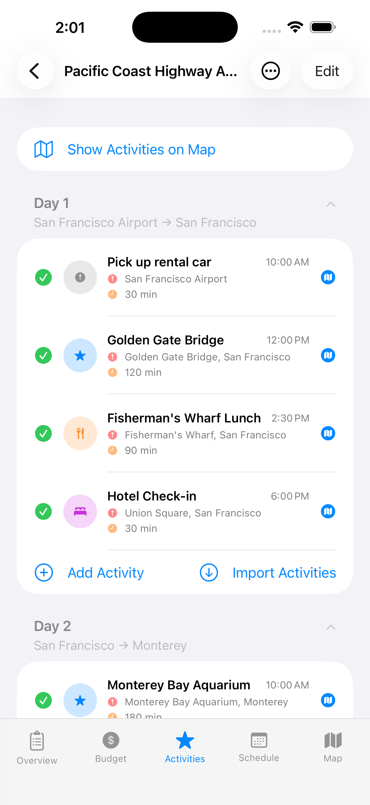
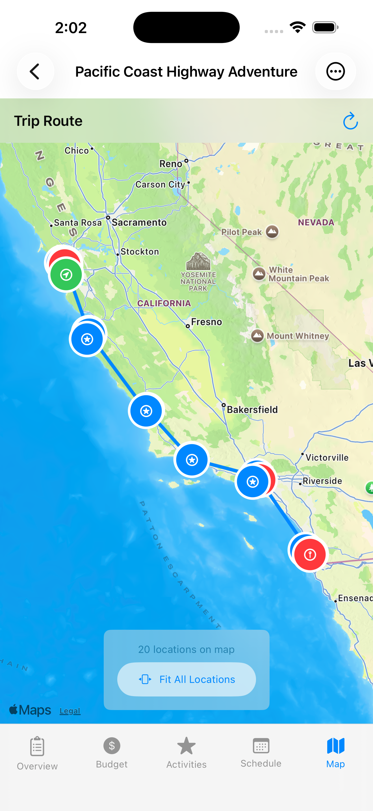
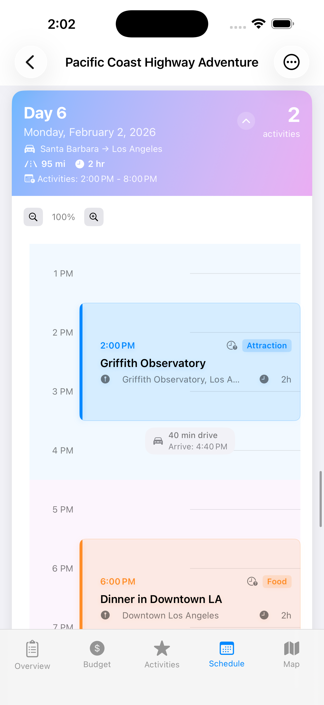
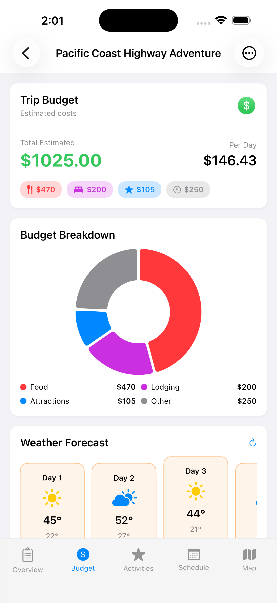
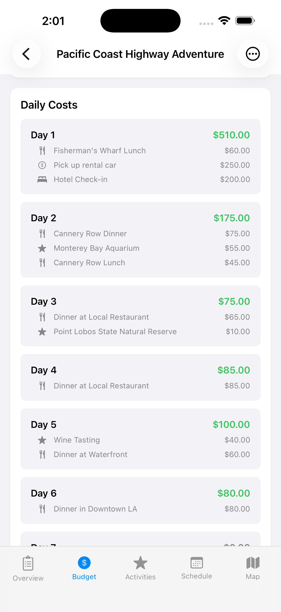
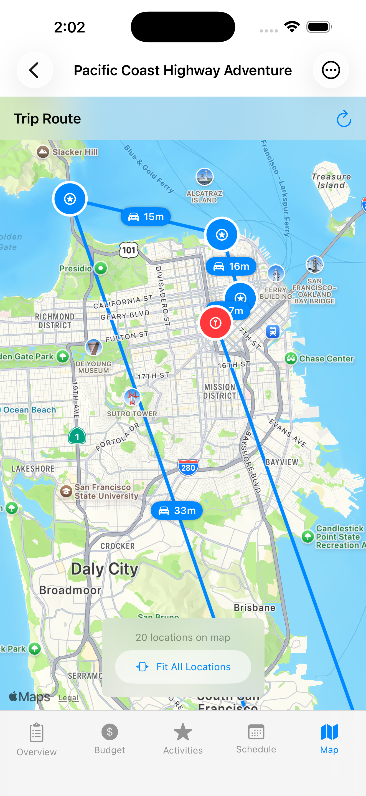
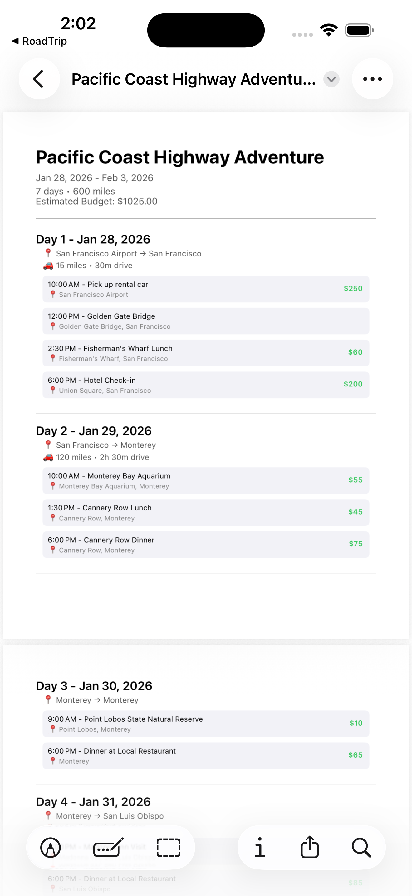

# RoadTrip — iOS trip planning with maps, schedules, and route-aware itineraries

A SwiftUI + SwiftData iOS app for planning multi-day road trips: organize activities per day, visualize everything on MapKit, and keep an itinerary that stays usable while you’re actually traveling.

> **Status:** Active development (iOS 17+). PRs welcome; see Contributing.

---

## Mission

Help people plan road trips that are realistic and easy to follow on the road by combining:
- a day-by-day schedule,
- location-aware activities,
- and route calculations that turn a list of places into a feasible itinerary.

## Project intention (what this repo is optimizing for)

This project is built to be:
- **A polished iOS engineering portfolio piece** (architecture, testing, UX polish, documentation)
- **A practical personal tool** (simple flows, persistent storage, resilient UI states)
- **A clean foundation for future “travel OS” features** (sharing, export, collaboration)

Non-goals (for now):
- Becoming a full booking platform (flights/hotels) or a production backend service
- Supporting iOS versions older than 17
- Complex multi-user sync across devices (unless/until CloudKit is added)

---

## Highlights

- **Multi-day trip planning** (start/end dates generate day segments)
- **Activity management** (category, time, duration, notes)
- **Maps + route context** (MapKit markers and driving estimates)
- **Schedule view** (timeline-style day planning)
- **SwiftData persistence** (data survives app restarts)
- **Responsive SwiftUI UI** (iPhone/iPad-friendly layouts)
- **Testing** (unit + UI tests)

---

## Screenshots / Demo

### Core flows to showcase
| Trip list | Trip details | Map view | Schedule view |
|---|---|---|---|
|  |  |  |  

| Trip budget | Trip day budgets | Map city view | Export PDF |
|---|---|---|---|
|  |  |  |  

### Short demo GIF (recommended)


---

## Requirements

- iOS 17.0+
- Xcode 15.0+
- Swift 5.9+

---

## Quickstart

```bash
git clone https://github.com/JJFrisch/RoadTrip.git
cd RoadTrip
open RoadTrip.xcodeproj

## Beta Distribution (TestFlight)

- TestFlight setup and upload guide: `docs/release/TestFlight-Setup.md`
- App Store export options for CLI builds: `docs/release/ExportOptions-AppStore.plist`
- Upload script: `scripts/testflight_beta_upload.sh`
